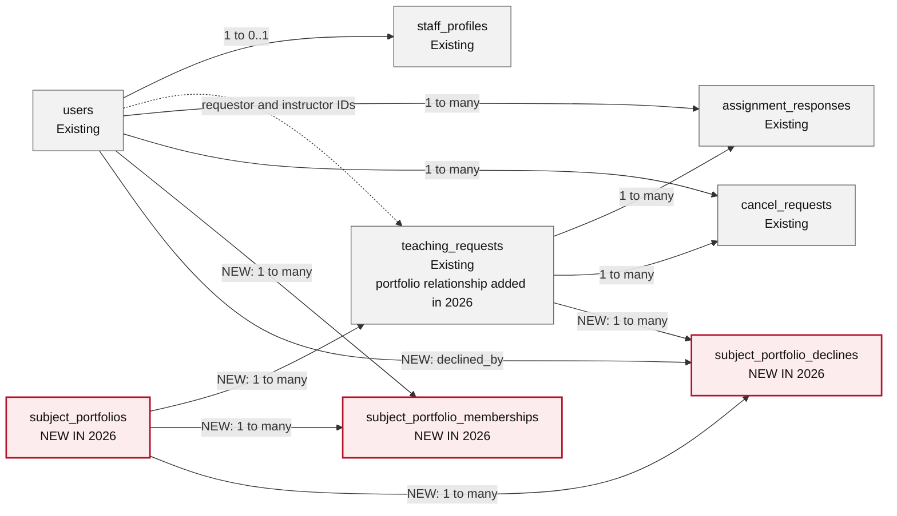

# Libstar Teaching Request Guide

Teaching requests move through several hands: the person asking for a class, the subject portfolio that coordinates the work, the instructor who accepts it, and the manager who keeps the request moving. This guide explains what each person sees, what Libstar does next, and where a decision is still needed.

The final section is a staging and client-demo checklist for the 2026 rollout.

## The Request Flow

A typical request follows this path:

1. A requestor submits a teaching request. Libstar records it as **New Request**.
2. A manager reviews the request and sends it to the most appropriate subject portfolio.
3. Libstar emails the portfolio's notification address. The request changes to **In Process**.
4. Portfolio members review the request and decide who should lead it.
5. The lead is confirmed in one of three ways: a member claims the request, a manager records an agreement that has already been made, or a manager asks a member to accept.
6. Once the lead is confirmed, the request changes to **Assigned**. Libstar notifies the requestor and the manager list.

### What the Status Labels Mean

| Status | What it means |
| --- | --- |
| **New Request** | The request has been submitted and is ready for a manager to route. |
| **In Process** | A portfolio is coordinating the request, or a proposed lead is considering it. |
| **Assigned** | A lead instructor has been confirmed. |
| **Done** | The work has been completed. |
| **Unfulfilled** | The request could not be fulfilled. |
| **Cancelled** | A legitimate cancellation has been reviewed and completed. The record remains available for reporting. |
| **Deleted** | A duplicate, test, or invalid record has been removed from normal operational reporting. |

## Choosing the Lead Instructor

There are three ways to confirm a lead. The right choice depends on whether the instructor is accepting the work themselves, has already agreed outside Libstar, or still needs to respond.

### A Portfolio Member Claims the Request

Use **Claim as lead** when a portfolio member is ready to take responsibility for the class.

- Libstar records that member as the lead immediately.
- The request changes to **Assigned**.
- No additional acceptance step is needed.
- The requestor and manager list receive confirmation.

This is the simplest path when the person doing the work is also the person recording the decision.

### A Manager Records an Existing Agreement

Use **Assign confirmed lead** when the manager already knows that the instructor has agreed, for example after a meeting or email conversation.

- Libstar records the selected instructor as the lead.
- The request changes to **Assigned**.
- The dashboard shows **Confirmed - no response required**.
- The instructor, requestor, and manager list receive confirmation.

This option should only be used when the agreement has already happened. It does not ask the instructor to respond in Libstar.

### A Manager Asks an Instructor to Accept

Use **Request lead acceptance** when the manager is proposing an instructor and still needs that person's decision.

- The request remains **In Process**.
- The dashboard shows **Awaiting lead response**.
- Libstar emails only the selected instructor with the accept and decline options.

The selected instructor can then respond:

| Response | What happens next |
| --- | --- |
| **Accept** | The instructor becomes the confirmed lead, the request changes to **Assigned**, and the requestor and manager list are notified. |
| **Decline** | Libstar removes the proposed lead, keeps the request with its portfolio, leaves it **In Process**, and emails the manager list with the reason. |

Only the selected instructor can accept or decline the invitation. Libstar rejects stale links and responses from another user.

## When a Portfolio Cannot Take the Request

Sometimes the issue is not the proposed instructor; the portfolio itself may be unable to handle the request. In that case, an active member of the assigned portfolio can use **Return to manager**.

The member must provide a reason and confirm the decision. Libstar then:

- removes the portfolio assignment;
- returns the request to **New Request**;
- records who returned it, when it was returned, and why; and
- emails the manager list so the request can be reassigned or reviewed.

The requestor is not emailed at this stage because the manager may still be able to find another portfolio or solution.

### A Decline and a Portfolio Return Are Different

| Situation | Use | Result |
| --- | --- | --- |
| One proposed instructor cannot take the class | **Decline lead invitation** | The request stays with the portfolio and another member can take it. |
| The portfolio cannot handle the request | **Return to manager** | The portfolio is removed and the request returns to the manager queue. |

Libstar keeps these actions separate so a single person's availability does not unnecessarily remove the request from a portfolio that may still be able to help.

### Safeguards and Audit History

Libstar allows a portfolio return only when all of the following are true:

- the person is signed in and has an active, approved staff profile;
- the person belongs to the assigned portfolio;
- the request is **In Process**;
- no lead has been selected; and
- a reason and explicit confirmation are provided.

The audit record and request update are saved together. If either operation fails, neither change is kept.

## Email Notifications

Libstar sends email when someone needs to act or should know that responsibility has changed.

| Event | Who receives an email | Purpose |
| --- | --- | --- |
| Manager assigns a portfolio | Portfolio notification address | A new request is ready for portfolio review. |
| Portfolio member claims the request | Requestor and manager list | A lead has been confirmed. |
| Manager records an agreed lead | Selected lead, requestor, and manager list | The confirmed assignment is recorded. |
| Manager requests acceptance | Selected instructor | A response is required. |
| Selected instructor accepts | Requestor and manager list | The lead is now confirmed. |
| Selected instructor declines | Manager list | The proposed lead declined; the reason is included. |
| Portfolio returns the request | Manager list | The request needs reassignment or review; the reason is included. |
| Someone requests cancellation | Cancellation recipients and manager list | A cancellation is waiting for review. |
| Manager marks a request cancelled | Requestor and manager list | The cancellation is complete. |
| Manager deletes a duplicate, test, or invalid request | No email | The record is retained as Deleted for administrative audit and reporting. |

The **manager list** comes from the active, approved staff roles configured for management notifications. **Cancellation recipients** are the existing dedicated cancellation recipients plus the manager list.

## Cancellation Requests

A cancellation request is a request for review; it does not immediately delete or close the teaching request.

1. The requestor, assigned instructor, manager, director, or administrator opens the cancellation form.
2. The person explains why the request should be cancelled and submits the form.
3. Libstar records who submitted the cancellation and emails the cancellation recipients and manager list.
4. The teaching request keeps its current status while the cancellation is waiting for review.
5. A manager, director, or administrator reviews the request and chooses the appropriate outcome.
6. For a legitimate cancellation, the manager selects **Mark cancelled**. Libstar changes the teaching request to **Cancelled** and emails the requestor and manager list.
7. For a duplicate, test, or invalid record, the manager selects **Delete**. Libstar changes the teaching request to **Deleted** and does not send a cancellation confirmation.

The cancellation request and teaching request remain available for audit and reporting. The final status makes legitimate cancellations countable without mixing them with administrative cleanup.

## Older Requests and Reporting

Older records do not need to be rewritten to take part in the new workflow. Requests without a subject portfolio continue to appear as **No portfolio / legacy**, and their existing instructors and statuses remain unchanged.

Managers can add a portfolio to an older request for classification and reporting. Doing so:

- does not remove or replace existing lead, second, or third instructors;
- does not change the request's status;
- does not send a new assignment email; and
- does record the manager, time, and reason in the audit history.

The one exception is an unassigned **New Request**. Adding a portfolio places it into the active portfolio queue and sends the normal portfolio notification.

Portfolio reporting includes both current and historical requests associated with that portfolio. Older records without a portfolio remain available through the legacy group.

## Database Structure (Workflow Scope)

This is the part of the Libstar data model used by the teaching-request, portfolio, lead-response, and cancellation workflows. It is intentionally focused and does not include unrelated application tables or Rails framework tables.

**Legend:** Gray boxes are existing tables. Pink boxes with a red border are labelled **NEW IN 2026**. Solid lines represent database foreign keys. Dashed lines represent Rails associations or stored user IDs that are not currently enforced by a database foreign key. The labels make the distinction readable even when the diagram is printed without colour.

| Table or relationship | Purpose and cardinality | Change status |
| --- | --- | --- |
| `users` → `staff_profiles` | A user may have one staff profile, which controls role and approval. The database foreign key is stored on `staff_profiles.user_id`. | Existing |
| `users` → `teaching_requests` | A request stores its requestor and up to three instructor IDs. These are Rails associations or stored IDs; the current schema does not enforce all of them with database foreign keys. | Existing |
| `teaching_requests` and `users` → `assignment_responses` | A teaching request may have many lead accept/decline responses. Every response belongs to one request and one user through required foreign keys. | Existing |
| `teaching_requests` and `users` → `cancel_requests` | A teaching request may have many cancellation requests. Each audit row records the person who submitted it and the reason. | Existing |
| `subject_portfolios` → `teaching_requests` | A portfolio may classify many teaching requests. `teaching_requests.subject_portfolio_id` is nullable so legacy records can remain unclassified. | **NEW RELATIONSHIP IN 2026** |
| `subject_portfolios` ↔ `users` through `subject_portfolio_memberships` | Portfolios and users have a many-to-many relationship. Both foreign keys are required, and the portfolio/user pair is unique. | **NEW TABLE AND RELATIONSHIPS IN 2026** |
| `subject_portfolio_declines` → request, portfolio, and user | Each portfolio return records one teaching request, its former portfolio, the member in `declined_by_id`, a required reason, and timestamps. | **NEW TABLE AND RELATIONSHIPS IN 2026** |

The 2026 database work is defined by migrations `20260817160000`, `20260817160100`, `20260817160200`, and `20260820190000`. The new foreign keys preserve portfolio membership and decline history. A portfolio or related record cannot be removed when doing so would break protected workflow history.

`TeachingRequest.status` continues to use the existing string column with Enumerize's numeric-coded values. **Cancelled** is stored as `"7"` and **Deleted** as `"9"`; adding the new status did not require a database migration or a separate status table.

## A Note About Unfulfilled Requests

The current **Unfulfilled** action stores internal notes together with the status change. An automatic requestor email is intentionally deferred until the client confirms what wording is appropriate and which internal details must remain private.

## Technical Acceptance Checklist

Use this checklist before staging approval or a production release.

1. Create a new teaching request and confirm that it appears as **New Request**.
2. Assign an active subject portfolio and confirm the request changes to **In Process**.
3. Confirm that the portfolio notification email is delivered.
4. Sign in as a portfolio member and claim the request. Confirm the request changes to **Assigned** and that the requestor and manager emails are delivered.
5. On another request, use **Assign confirmed lead**. Confirm the lead is immediately assigned and no response is required.
6. On another request, use **Request lead acceptance**. Confirm the request remains **In Process** and only the selected instructor receives the invitation.
7. Test both acceptance and decline. Confirm the correct status, lead, dashboard label, and email recipients.
8. Return an unclaimed portfolio request to the manager. Confirm the portfolio is removed, the request returns to **New Request**, and the reason appears in the audit history and manager email.
9. Confirm that a user outside the assigned portfolio cannot return the request.
10. Add a portfolio to an older completed or active request. Confirm its instructors and status do not change.
11. Request a cancellation. Confirm the teaching request keeps its current status while the cancellation awaits review.
12. Select **Mark cancelled** as a manager. Confirm the request changes to **Cancelled** and the expected emails are delivered.
13. On a separate duplicate or test record, select **Delete**. Confirm the request changes to **Deleted** and no cancellation email is delivered.
14. Review portfolio and legacy reports to confirm both current and historical records remain available.

## Phase 7: Staging Review and Client Demo

The client demo should feel like a conversation about their work, not a technical test run. Use real-world examples, pause at each decision point, and confirm that the wording and responsibilities match how the team actually operates.

### Prepare Staging

- [ ] Deploy the release candidate to staging.
- [ ] Run `bundle exec rails db:migrate` and confirm migration version `20260820190000` is applied.
- [ ] Confirm the application boots without new errors or unexpected warnings.
- [ ] Run the regular and system test suites against the staging release candidate.
- [ ] Create at least two active subject portfolios with safe staging email addresses.
- [ ] Add active staff members to each portfolio.
- [ ] Prepare accounts for a manager, two portfolio members, a requestor, and a staff member outside the portfolio.
- [ ] Confirm that outbound mail is directed to MailCatcher or approved staging inboxes.
- [ ] Create several sample requests so each assignment path can be demonstrated without resetting data during the meeting.
- [ ] Do not run `fake:generate` in staging or production.

### Suggested Demo Conversation

| Topic | What to show | What to confirm with the client |
| --- | --- | --- |
| A new request arrives | Submit a request, then route it to a portfolio. | Is the portfolio choice made by the right role, and is the notification useful? |
| A member volunteers | Sign in as a portfolio member and use **Claim as lead**. | Does immediate confirmation match how volunteered work should be handled? |
| An agreement already exists | Use **Assign confirmed lead** as a manager. | Is **Confirmed - no response required** clear enough? |
| A manager proposes a lead | Use **Request lead acceptance**, then accept as the selected member. | Are the invitation and confirmation messages clear? |
| A proposed lead declines | Decline with a reason. | Does the request return to the portfolio in a way that supports choosing someone else? |
| The portfolio cannot help | Use **Return to manager** with a reason. | Should the manager be the only recipient at this stage? |
| An older request is classified | Add a portfolio to an older assigned or completed request. | Are the preserved instructors, status, and audit history what the client expects? |
| A request is cancelled | Submit a cancellation, then select **Mark cancelled** as a manager. | Are the review step, recipients, and final wording appropriate? |
| A duplicate or test request is removed | Submit or locate the record, then select **Delete**. | Is the distinction from a legitimate cancellation clear? |
| Work is reviewed | Open portfolio and legacy reports. | Can managers find both current and historical work easily? |

### Decisions to Confirm During the Demo

- [ ] Final wording for portfolio assignment, lead acceptance, decline, return, and cancellation emails.
- [ ] Whether any roles beyond managers, directors, and administrators should complete cancellations.
- [ ] Whether Cancelled and Deleted should both appear in every report or only in manager reports.
- [ ] Whether the requestor should eventually be notified when a portfolio returns a request.
- [ ] Whether the **Unfulfilled** workflow needs a separate requestor-facing explanation field.
- [ ] Whether portfolio reports need date, status, instructor, or export filters before production.
- [ ] Whether any existing records should be assigned to portfolios before launch.
- [ ] Who will create portfolios and maintain membership after launch.

### Approval Record

| Item | Record |
| --- | --- |
| Staging release or commit |  |
| Demo date |  |
| Client representatives |  |
| Technical representative |  |
| Decisions and follow-up work |  |
| Approved for production | Yes / No |
| Approver and date |  |

Record unresolved items as tracked follow-up work before production deployment. Approval should name the exact staging release or commit that was reviewed.
